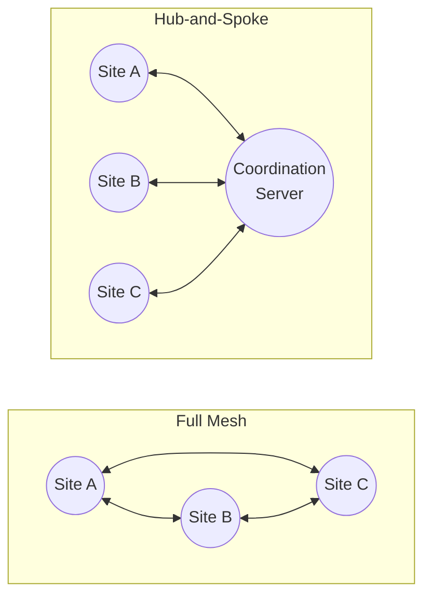

> **Related Reading:** [How WireGuard Mesh Control Planes Manage Keys, Peers & Routes](/blog/how-wireguard-mesh-control-plane-manages-keys-peers-routes/)

> **Related Reading:** [Managing Multiple WireGuard Tunnels & Mesh VPN Guide (2026)](/blog/manage-multiple-wireguard-tunnels-mesh-vpn-2026/)

<div class="cluster-nav" style="background: var(--bg-2); padding: 16px; border-radius: 8px; margin-bottom: 24px; border: 1px solid var(--border);">
  <strong>MeshWG Architecture Guides (Cluster):</strong>
  <ul style="margin: 8px 0 0 16px;">
    <li><a href="/blog/wireguard-site-to-site-vpn-how-it-works-2026/">Site-to-Site VPN Architecture</a></li>
    <li><a href="/blog/how-to-build-a-multi-location-wireguard-network-with-routers/">Multi-Location Router Networks</a></li>
    <li><a href="/blog/wireguard-nat-traversal-behind-cgnat-2026/">NAT Traversal & CGNAT Guide</a></li>
    <li><a href="/blog/managed-vs-self-hosted-wireguard-vpn-2026/">Enterprise Branch Networking</a></li>
    <li><a href="/blog/cloud-wireguard-vpn-meshwg/">Cloud-to-Branch Connectivity</a></li>
    <li><a href="/blog/sd-wan-alternatives-2026/">SD-WAN Alternatives</a></li>
  </ul>
</div>

<div class="bp-intro">
    <article class="tldr-box">
      <h3>TL;DR</h3>
      <ul>
        <li><strong>No New Hardware or Agents:</strong> A WireGuard mesh VPN connects all your locations into one private, encrypted network — without buying new hardware, without installing an agent on every device, and without managing certificates. The setup takes under two minutes per site.</li>
        <li><strong>Automated Orchestration:</strong> This tutorial walks you through MeshWG, a hosted WireGuard mesh platform that turns the routers you already own (TP-Link, MikroTik, OpenWrt, Ubiquiti, OPNsense, pfSense) into a cloud-managed private mesh with central zero-trust policies.</li>
        <li><strong>1/10th the Cost of SD-WAN:</strong> The first two machines are free forever, with no card and no time limit. A 20-site deployment runs around ₹7,000 a month — roughly one-tenth of a comparable traditional SD-WAN deployment.</li>
        <li><strong>Fast Setup:</strong> If you want to skip the theory, create your free account and jump to Step 1. Otherwise, read on to understand why the setup works and how to avoid the mistakes that break most DIY WireGuard meshes.</li>
      </ul>
    </article>
</div>

## What a WireGuard mesh VPN actually is

Before we touch a single config file, it is worth being precise about what we are building. A WireGuard mesh VPN is a private, encrypted network in which every participating site can talk to every other site directly, using the WireGuard protocol as the transport. The word "mesh" describes the topology: instead of forcing all traffic through a single central gateway (the hub-and-spoke model), each node can reach its peers over encrypted tunnels.

The critical distinction for this tutorial is the difference between WireGuard the protocol and WireGuard the mesh. WireGuard the protocol is a modern, audited, kernel-level VPN protocol — fast, simple, and secure. But the protocol alone does not give you a mesh. A mesh needs a coordination layer: something that tells each router which peers to trust, what IP addresses to assign, and where to send traffic. That coordination layer is what turns a pile of individual WireGuard tunnels into a coherent private network.

This is where most DIY attempts stall. You can hand-configure WireGuard on two routers in an afternoon. You can even get three or four sites talking. But the moment you need to add a branch, revoke a device, rotate a key, or enforce a policy across twenty sites, the manual coordination work becomes the bottleneck. A cloud-managed mesh like MeshWG automates that coordination layer, which is exactly why the setup in this tutorial is fast enough to be a step-by-step guide rather than a multi-week project.

The config you will generate is a standard `wg-quick` WireGuard config — the same format WireGuard itself uses. That matters for two reasons. First, it means the config works on any router that supports WireGuard, regardless of vendor. Second, it means you are not locked into a proprietary format; the underlying network is built on an open, standard protocol.

### Full mesh vs hub-and-spoke: which topology are you actually building?

It is worth pausing on topology, because the word "mesh" gets used loosely and the distinction shapes how you think about the setup. There are two common ways to organise a WireGuard network.

**Full mesh.** Every site maintains a direct encrypted tunnel to every other site. Traffic flows point-to-point, with no intermediary. This gives the lowest latency and the most direct path, but it scales poorly: the number of tunnels grows quadratically with the number of sites. Ten sites means 45 tunnels; fifty sites means 1,225 tunnels. Configuring and maintaining that by hand is not realistic.

**Hub-and-spoke.** Every site connects to a single central hub, and the hub routes traffic between them. This is the model MeshWG uses. Each router maintains exactly one tunnel — to the coordination server — and the server coordinates the mesh. This scales linearly: fifty sites means fifty tunnels, each identical in structure. The trade-off is that inter-site traffic traverses the hub, which adds a small amount of latency but dramatically simplifies management.



The practical implication for this tutorial is simple: you never configure a direct peer link between your branches. Each router only needs to know about the coordination server. The mesh layer handles the rest. That is why adding site number twenty is no harder than adding site number two — and it is the architectural reason a mesh VPN is viable for the 5-to-50-branch business that a full-mesh DIY setup would crush under its own complexity.

### Why the coordination layer changes everything

The single biggest reason most WireGuard projects stall is not the protocol — it is the coordination. In a manual setup, every time you add a site you must:

1. Generate a keypair for the new site.
2. Add the new site's public key to every existing site's config.
3. Add every existing site's public key to the new site's config.
4. Assign a non-conflicting private IP.
5. Update AllowedIPs on every peer.
6. Push the updated configs to every router and restart the tunnels.

That is a six-step operation repeated for every site, and it is exactly the kind of repetitive, error-prone work that a coordination layer automates. MeshWG generates the keys, assigns the IPs, distributes the peer information, and propagates changes across the mesh automatically. The operational tax that makes DIY WireGuard a full-time job for a specialist is precisely what a managed mesh removes.

## Why you need one in 2026 (and why now)

The conditions that made WireGuard mesh VPNs practical for ordinary businesses have only recently aligned. Three shifts between 2018 and 2026 changed the picture.

- **Fibre got cheap and reliable.** The broadband connections most small and mid-market businesses use today are fast enough to carry production traffic between branches. The old argument that you needed expensive MPLS or a dedicated SD-WAN appliance to get usable inter-site performance no longer holds for the 5-to-50-branch segment.
- **WireGuard became a commodity.** WireGuard shipped in the Linux kernel in 2020 and has since proliferated into the firmware of the routers most businesses already own. TP-Link, MikroTik, OpenWrt, Ubiquiti, OPNsense, and pfSense all support it natively. The encryption technology that used to require specialist hardware is now built into the box on your shelf.
- **Carrier-grade NAT became the default.** Most consumer and small-business internet connections now sit behind CGNAT, which breaks the old assumption that every site has a reachable public IP. A mesh VPN handles this natively — every branch dials outbound to the coordination server, so [NAT traversal](/blog/wireguard-nat-traversal-behind-cgnat-2026/) stops being a configuration problem.

The result is that the question is no longer "can we afford a private network?" It is "how do we set one up without a specialist team?" That is precisely the question this tutorial answers.

### The cost reality that makes this decision easy

It is worth being concrete about the economics, because the numbers are what usually tip a decision. A traditional SD-WAN deployment for twenty branches typically involves a hardware appliance at each site (₹35,000 to ₹2,50,000 per site), a licensing line, and a procurement-to-production cycle measured in months. The five-year total cost of ownership for that model runs into the tens of lakhs.

A managed WireGuard mesh changes the shape of that cost. There is no hardware to buy — you use the routers you already own. There is no licensing complexity — a single per-machine recurring fee. And there is no multi-month rollout — each site comes online in under two minutes. A twenty-site deployment on MeshWG runs around ₹7,000 a month, which works out to roughly one-tenth of a comparable SD-WAN deployment over five years. The first two machines are free forever, so you can validate the entire model on real branches before committing a rupee.

The point is not that SD-WAN is bad — it is the right answer for enterprises that genuinely operate at the scale and complexity the category was designed for. The point is that for the 5-to-50-branch business, the mesh model delivers the outcomes that matter — encrypted transport, central policy, a status dashboard — without the budget overhead of features the deployment will never exercise.

## What you need before you start

The good news: the prerequisites are minimal. Here is the complete checklist.

- **Hardware.** One router per site that supports WireGuard. MeshWG supports 57 router models across 9 vendor families — TP-Link (15 models), MikroTik (10), Ubiquiti (9), GL.iNet (6), Asus (7), Synology (1), OPNsense (6), pfSense (2), and generic WireGuard (1). If your router runs OpenWrt or a recent vendor firmware with WireGuard support, you are almost certainly covered. You do not need to buy anything new.
- **Internet.** A working internet connection at each site. Because every router dials outbound, you do not need a static public IP, and you do not need to open any inbound ports on your firewall.
- **A browser.** The entire MeshWG control plane runs in the browser. There is no software to install on your laptop, and no agent to install on client devices.
- **About ten minutes.** The first machine takes under two minutes once you have the config. The whole tutorial, including verification and policies, fits comfortably in a single working session.

That is the entire list. No firmware flashing, no certificate authority, no static IPs, no specialist installer to schedule. If you have a router and an internet connection, you have everything you need.

### A note on the "no agent" and "no certificate" claims

Two phrases in MeshWG's positioning deserve a moment of clarity, because they are genuinely different from what most VPN products promise.

**No agent.** Traditional mesh products like Tailscale or ZeroTier require you to install a small client program (an "agent") on every device that joins the network. That is fine for a fleet of laptops, but it is a real burden when the devices are routers, servers, or IoT hardware you do not control. MeshWG's model runs the WireGuard client natively on the router itself — there is no agent to install on client devices. The router is the endpoint. This is what makes the "works with the routers you already own" claim meaningful.

**No certificates.** Many enterprise VPNs and ZTNA platforms rely on a certificate authority to issue and revoke device certificates. Managing a CA — generating certificates, distributing them, tracking expiry, handling revocation — is a significant operational burden. MeshWG uses WireGuard's native key-based authentication instead. Each machine has a keypair, the coordination layer manages distribution, and there is no certificate lifecycle to babysit. The server-side keys are encrypted at rest, so even the platform cannot read your private keys in plaintext.

These two design choices are the reason the setup in this tutorial is as short as it is. Remove the agent-install step and the certificate-management step, and what remains is a genuinely simple process.

## Step 1 — Create your MeshWG account

The first step is to create your free account. Go to the MeshWG signup page and register. The free tier includes two machines forever, with no credit card and no time limit — so you can complete this entire tutorial at zero cost.

When you sign up, MeshWG creates a strictly isolated organization for you. This is a deliberate architectural choice: your network is isolated from every other organization on the platform, and there is no shared address space or cross-tenant routing. Your private IP range, your peers, and your policies live in their own tenant.

Once your account is created, you land on the dashboard. This is your coordination layer — the single place where you will add machines, generate configs, and apply policies. Take a moment to note the private IP range assigned to your organization (the default is a `10.100.0.0/16` style range). Every machine you add will get an address from this range.

### Why per-organization isolation matters

The isolation you get at signup is not a cosmetic feature — it is a security property. In a multi-tenant platform, the risk is always that one customer's traffic or configuration leaks into another's. MeshWG's architecture prevents this by design: each organization gets its own private address space, its own peers, and its own policies, with no shared routing between tenants. There is no internet egress path from the mesh itself, which means the platform is not a potential exit point for your traffic. This strict isolation is what makes the platform suitable for regulated environments and for organisations that take data residency seriously.

## Step 2 — Add your first machine

In the dashboard, click Add Machine. MeshWG will ask you to name the machine and identify its role. For this tutorial, we will add the first site — call it `branch-01` or `head-office`, depending on which site you are configuring first.

When you add a machine, MeshWG does two things behind the scenes:

1. It generates a WireGuard keypair for that machine. The private key is delivered to you once, in the config, and the server-side copy is encrypted at rest. MeshWG never stores your private key in plaintext.
2. It assigns a private IP address from your organization's range to the machine.

You do not need to generate keys yourself, and you do not need to manage a certificate authority. The coordination layer handles key distribution for you — which is the single biggest time-saver compared to a manual WireGuard setup.

## Step 3 — Generate the WireGuard config

After adding the machine, MeshWG generates a ready-to-use WireGuard config. It looks like a standard `wg-quick` config, and it is — that is the point. Here is what a typical generated config contains:

```ini
[Interface]
PrivateKey = <your-generated-private-key>
Address = 10.100.0.2/16
MTU = 1420

[Peer]
PublicKey = <meshwg-server-public-key>
Endpoint = vpn.meshwg.com:51820
AllowedIPs = 10.100.0.0/16
PersistentKeepalive = 25
```

Let us walk through each line, because understanding this config is what separates a copy-paste setup from one you can actually troubleshoot.

- `PrivateKey` — the machine's WireGuard private key, generated by MeshWG. Keep it secret; it is the credential that authenticates this machine to the mesh.
- `Address` — the private IP assigned to this machine, with the subnet mask. `10.100.0.2/16` means this machine is 10.100.0.2 on a 10.100.0.0/16 network.
- `MTU` — the maximum transmission unit. 1420 is the standard value for WireGuard over typical broadband, chosen to avoid fragmentation. If you have unusual network conditions, this is the value you might tune (more on that in the performance section).
- `[Peer]` — the remote endpoint this machine connects to. In a mesh VPN, every machine connects to the coordination server (`vpn.meshwg.com:51820`), which then coordinates the mesh. This is the hub-and-spoke control plane that makes NAT traversal and key management work.
- `AllowedIPs` — the routes this tunnel carries. `10.100.0.0/16` tells the router "send all traffic destined for the mesh's private range through this tunnel."
- `PersistentKeepalive` — a keepalive every 25 seconds. This is what keeps the tunnel alive through NAT and CGNAT, because it ensures the router is always sending outbound packets that keep the NAT mapping fresh.

Copy this config. You will paste it into your router in the next step.

### Why the config is standard (and why that is a feature)

A common worry with managed VPN platforms is lock-in — that you will be trapped in a proprietary format and unable to leave. MeshWG's use of a standard `wg-quick` config removes that concern. The config you generate is the same format WireGuard itself uses, which means:

- It works on any router that supports WireGuard, regardless of vendor.
- It is readable and auditable — you can see exactly what the tunnel does.
- It interoperates with the broader WireGuard ecosystem of standard tools.
- You are not locked into a proprietary protocol; the network is built on an open standard.

This is a deliberate architectural choice, and it is worth understanding because it affects your long-term flexibility. A standard-protocol foundation means you are not hostage to a single vendor's roadmap. Routers can be replaced as needed, with the rest of the deployment unchanged.

## Step 4 — Apply the config to your router (by vendor)

This is the step where the setup becomes concrete, because the exact click-path depends on your router's firmware. The good news is that the underlying config is identical — only the interface differs. Here is how to apply it on the most common platforms.

**TP-Link (Omada / business routers)**
In the TP-Link web interface, navigate to VPN → WireGuard. Create a new tunnel, paste the config, and save. TP-Link's business routers (ER605, ER7206, ER8411) and many Deco models support WireGuard natively. [Read our dedicated TP-Link guide.](/blog/tp-link-site-to-site-vpn-wireguard-2026/)

**MikroTik (RouterOS)**
In Winbox or the web interface, open Interfaces → WireGuard. Add a new interface, then add a peer. Paste the PrivateKey into the interface and the peer details (public key, endpoint, allowed IPs, keepalive) into the peer. RouterOS 7.x has first-class WireGuard support.

**OpenWrt**
OpenWrt is the most flexible option. Install the `wireguard` package if it is not already present, then either use the LuCI web interface (Network → Interfaces → Add new interface → WireGuard) or drop the config into `/etc/config/network`.

**Ubiquiti (UniFi)**
In the UniFi controller, navigate to Settings → Networks → Create New Network → WireGuard. Paste the config. Ubiquiti's newer firmware supports WireGuard on supported gateways.

**OPNsense / pfSense**
Both firewall distributions support WireGuard via a plugin. In OPNsense, install the `os-wireguard` plugin, then add the interface and peer. In pfSense, install the WireGuard package and configure the tunnel. Paste the config values into the corresponding fields.

**GL.iNet**
GL.iNet routers ship with WireGuard support built in. In the LuCI-based interface, navigate to VPN → WireGuard, add a new tunnel, and paste the config.

The pattern is consistent across all vendors: create a WireGuard interface, add a peer, paste the config values, save, and enable the tunnel. If your specific model is not listed here, the MeshWG compatibility page has the full 57-model list with firmware notes.

Once the tunnel is enabled, the router dials outbound to `vpn.meshwg.com:51820` and joins the mesh. This is the moment your first site comes online — typically within seconds.

## Step 5 — Add your second machine

Now repeat Steps 2 through 4 for your second site. In the dashboard, click Add Machine, name it (for example, `branch-02`), generate its config, and apply it to the second router.

Here is where the mesh value becomes visible. You do not need to configure a tunnel between the two sites manually. Each machine only needs to know about the coordination server. The mesh layer handles the peer relationships, so `branch-01` and `branch-02` can reach each other over the private range without you ever configuring a direct peer link between them.

This is the fundamental difference from a manual WireGuard setup. In a manual setup, adding a third site means editing the config on every existing site to add the new peer. In a mesh, you add the new machine once, and the coordination layer propagates the change. The effort to add site number 20 is the same as the effort to add site number 2.

## Step 6 — Verify the tunnel is live

With two machines online, it is time to verify the mesh is actually working. MeshWG's dashboard shows the status of every machine — online, offline, and last-seen. But you should also verify at the network level, because that is what proves the tunnel is carrying real traffic.

From a device on `branch-01`, ping the private IP of `branch-02`:

```bash
ping 10.100.0.3
```

If the mesh is working, you will get replies. You can also check the WireGuard interface on the router itself:

```bash
wg show
```

*(Illustrative output)*
```text
interface: wg0
  public key: aBcDeFgHiJkLmNoPqRsTuVwXyZ123456789=
  private key: (hidden)
  listening port: 51820

peer: ZyxWvUtSrQpOnMlKjIhGfEdCbA987654321=
  endpoint: 198.51.100.1:51820
  allowed ips: 10.100.0.0/16
  latest handshake: 1 minute, 12 seconds ago
  transfer: 1.45 MiB received, 3.20 MiB sent
  persistent keepalive: every 25 seconds
```

This shows the interface's public key, the peer it is connected to, the latest handshake time, and the transfer counters. A recent handshake and rising transfer counters confirm the tunnel is live and passing traffic.

## Step 7 — Apply zero-trust access policies

A mesh VPN connects your sites, but a secure mesh controls what can talk to what. This is where MeshWG's zero-trust access layer comes in.

By default, you can define access policies that govern traffic between machines. The policies are evaluated before traffic reaches its destination, which is the defining characteristic of a zero-trust model — access is decided at the edge, not assumed because a machine is "inside" the network.

You can build policies that allow or deny traffic based on:
- **Port** — allow only specific services (for example, allow 443 for a web app, deny everything else).
- **Protocol** — restrict to TCP, UDP, or specific protocols.
- **Machine** — allow specific machines to reach specific destinations, and deny all others.

For example, a typical policy might say: "`branch-02` may reach the database server on `10.100.0.5` over TCP port `5432`, and nothing else." That is a far tighter posture than the traditional "everything on the private network can reach everything" model.

## Step 8 — Scale to more sites

The final step is the one that makes the whole exercise worthwhile: adding more sites. Because the mesh handles coordination, scaling is a repeat of Steps 2 through 4 for each new location. If you are planning a large rollout, you may also find our guide on [multi-location WireGuard networks](/blog/wireguard-site-to-site-vpn-multiple-locations/) helpful.

For a business opening a new branch, the on-site step is genuinely simple:
- A local manager (not a network engineer) can paste the generated config into the router.
- There is no hardware to ship or firmware to flash.
- There is no specialist installer to schedule.

A new site comes online in under two minutes.

This is the operational reality that makes mesh VPN attractive for growing businesses. Retail chains opening seasonal locations, clinic groups expanding into new neighbourhoods, distributor networks reshuffling their footprint, and professional-services firms acquiring smaller offices all benefit from a network that grows at the pace of the business, not the pace of the IT project.

## Performance: what to expect and how to tune it

WireGuard is fast — it runs in the kernel, which means it avoids the userspace overhead of older VPN protocols. On modern router hardware, you can expect near line-rate throughput for typical branch workloads. But performance is not automatic; it depends on a few factors you can control.

### MTU tuning
The most common performance issue in a WireGuard mesh is MTU misconfiguration. The default 1420 is chosen to avoid fragmentation over typical broadband (which has a 1500-byte MTU, minus WireGuard's ~80 bytes of overhead). If your network has additional overhead — for example, if you are tunnelling over another VPN or a network with a lower MTU — you may need to lower it.

### Throughput expectations
For most branch workloads — file access, database queries, web applications — a WireGuard mesh on modern router hardware provides more than enough throughput. The bottleneck is almost always the broadband connection, not the VPN. 

### Latency
Because a hub-and-spoke mesh routes inter-site traffic through the coordination server, there is a small latency cost compared to a direct point-to-point tunnel. For most applications this is negligible — we are talking milliseconds, not seconds. 

## DIY vs managed mesh VPN, side by side

The honest question most readers have at this point is: why not just set up WireGuard myself? It is a fair question, and the answer deserves a direct comparison. 

| Dimension | DIY WireGuard mesh | Managed mesh (MeshWG) |
| --- | --- | --- |
| **Time to first site** | Hours to days, dependent on team experience | Under two minutes per site |
| **Adding a new site** | Edit config on every existing peer | Add the machine once; mesh propagates |
| **Key management** | Manual generation, distribution, rotation | Automated; server-side keys encrypted at rest |
| **NAT / CGNAT handling** | Manual NAT-traversal configuration | Native — every site dials outbound |
| **Revoking a device** | Manual config edits across peers | One click; policy applies instantly |
| **Access policies** | Requires separate firewall rules per site | Central zero-trust policies, enforced before destination |
| **Hardware required** | Existing router (if compatible) | Existing router — no new hardware |
| **5-year TCO (20 branches)** | ₹0 software + significant in-house engineering hours | Around ₹4.2 lakhs total, no surprises |

The DIY path is legitimate for teams with deep WireGuard expertise and a stable, small site count. The managed path wins for the 5-to-50-branch business whose IT function is a generalist team, not a network operations centre.

## Common mistakes worth avoiding

Over years of watching teams set up WireGuard meshes, a handful of mistakes recur. Naming them up front will save you the trouble.

1. **Forgetting the keepalive.** Without `PersistentKeepalive`, tunnels behind NAT silently drop when the NAT mapping expires. The default of 25 seconds in the MeshWG config prevents this. Do not remove it.
2. **Wrong MTU.** An MTU that is too high causes fragmentation and mysterious packet loss. The standard 1420 works for most broadband.
3. **Overly broad AllowedIPs.** Using `0.0.0.0/0` in `AllowedIPs` routes all traffic through the tunnel, not just mesh traffic. Unless you specifically want full-tunnel routing, keep `AllowedIPs` scoped to your private mesh range.
4. **No access policies.** Connecting all your sites and then allowing everything to reach everything recreates the flat-network problem you were trying to escape. Apply least-privilege policies from day one.
5. **Treating the mesh as a replacement for everything.** A mesh VPN is not a substitute for a firewall, endpoint security, or good password hygiene. It is the transport layer; the security model still needs the rest of the stack.

## Troubleshooting the top five failures

Even with a clean setup, things occasionally go wrong. Here are the five most common failures and how to resolve them.

1. **Tunnel is up but no traffic flows.** Check `AllowedIPs` on both ends. If the destination's private IP is not covered by the route, the router will not send it through the tunnel. 
2. **Handshake keeps failing.** Confirm the endpoint (`vpn.meshwg.com:51820`) is reachable and that UDP port 51820 is not blocked outbound. WireGuard uses UDP, and some firewalls block UDP by default.
3. **Intermittent drops.** Almost always an MTU or keepalive issue. Lower the MTU in steps, and confirm `PersistentKeepalive` is set.
4. **One site can reach the server but not another site.** This is a policy or routing issue, not a connectivity issue. Check the access policy between the two machines, and confirm both are in the same mesh range.
5. **Config pasted but interface not appearing.** Some router firmwares require you to enable the interface or apply changes after pasting. Check the router's apply/save step, and confirm the firmware version supports WireGuard.

## Security best practices for a production mesh

Once your mesh is running, these practices keep it production-grade.

- **Rotate keys on a schedule.** Even with automated key management, plan for periodic rotation — especially for machines that handle sensitive traffic.
- **Enforce least-privilege policies.** Default-deny is the right posture. Allow only the specific ports, protocols, and machine-to-machine paths your applications actually need.
- **Monitor machine status.** The dashboard's online/offline view is your early-warning system. 
- **Keep router firmware current.** WireGuard support and security fixes ship in firmware updates. Keep your routers patched.

## How the setup plays out by sector

Different sectors arrive at this setup from different starting points, and the patterns are consistent enough to name.

- **Retail and franchise chains.** The dominant factor is deployment speed — new stores open on a schedule the network must keep up with. 
- **Healthcare and clinic groups.** Reliability and data residency dominate. A mesh with an India-resident control plane addresses DPDP-style residency requirements.
- **Manufacturing and industrial operations.** These often run a hybrid — a mesh for corporate-to-branch connectivity, with IPsec retained for specific partner integrations where the protocol is mandated.
- **Professional services and consulting firms.** The priority is connecting regional offices to central case-management systems and supporting remote work. 

## Conclusion

Setting up a WireGuard mesh VPN is no longer a specialist project. The protocol is a commodity, the routers you already own support it, and a coordination layer removes the operational tax that used to make multi-site WireGuard a full-time job. What remains is a genuinely simple process: create an account, add a machine, generate a standard wg-quick config, paste it into a router, and repeat.

The decision framework is straightforward. If you have two or three stable sites and deep WireGuard expertise, a manual setup is a legitimate choice. But the moment your network grows past a handful of sites, or a non-specialist needs to bring up a branch, or you need consistent access policies across the mesh, the managed model becomes the difference between a network that works and one that consumes your team's time.

The most honest way to evaluate any of this is to run it on real branches. Two machines are free indefinitely, with no card and no time limit, so you can validate the entire model against your actual environment before committing a rupee. If the setup took you under two minutes per site and the mesh held up under real traffic, you have your answer.

## References

- **WireGuard — Fast, Modern, Secure VPN Tunnel.** Official protocol documentation and the wg-quick configuration reference. https://www.wireguard.com/
- **WireGuard: Next Generation Kernel Network Tunnel** (Jason A. Donenfeld, NDSS, 2017). The original paper on the protocol's design and security.
- **WireGuard in the Linux Kernel.** Kernel 5.6 merge (2020) that made WireGuard a first-class in-kernel protocol. https://www.kernel.org/
- **RFC 8201 — Path MTU Discovery for IP version 6.** Reference for the MTU and fragmentation behaviour in the performance section.
- **MeshWG — Hosted WireGuard Mesh + Zero-Trust Access.** Product documentation and router compatibility list (57 models across 9 vendor families). https://meshwg.com/
- **[Mesh VPN vs IPsec vs SD-WAN (2026)](/blog/mesh-vpn-vs-ipsec-vs-sdwan-2026/)** Companion post on topology and cost comparison.


## Frequently Asked Questions (FAQ)

<details>
<summary>What is a WireGuard mesh VPN?</summary>
A WireGuard mesh VPN is a private, encrypted network where every participating site can reach every other site directly over the WireGuard protocol, coordinated by a central layer that manages keys, IPs, and peer relationships.
</details>

<details>
<summary>How long does it take to set up a WireGuard mesh VPN?</summary>
With a managed platform like MeshWG, the first site comes online in under two minutes. A complete two-site mesh, including verification and policies, fits in a single working session.
</details>

<details>
<summary>Is a WireGuard mesh VPN secure?</summary>
Yes, when configured correctly. WireGuard is a modern, audited, kernel-level protocol, and MeshWG adds zero-trust access policies that are enforced before traffic reaches its destination, plus server-side keys encrypted at rest.
</details>

<details>
<summary>How much does it cost?</summary>
The first two machines are free forever. A 20-site deployment runs around ₹7,000 a month — roughly one-tenth of a comparable SD-WAN deployment.
</details>

<details>
<summary>Can I add sites later?</summary>
Yes. Adding a site is a self-service step that takes under two minutes, and the mesh propagates the change automatically. Scaling from 2 to 50 sites uses the same process.
</details>

<details>
<summary>How does a mesh VPN differ from a traditional VPN?</summary>
A traditional VPN routes all traffic through a central gateway, creating a bottleneck. A mesh VPN establishes direct, peer-to-peer connections between all devices (like branch offices or cloud servers), reducing latency and eliminating a single point of failure.
</details>

<details>
<summary>Does MeshWG require installing software on every device?</summary>
No. MeshWG can be deployed directly on your existing edge routers (like TP-Link, MikroTik, or OpenWrt). This provides agentless, site-wide protection for all devices behind the router without installing VPN clients on individual laptops or IoT devices.
</details>

<details>
<summary>How does WireGuard NAT Traversal work?</summary>
WireGuard doesn't have native NAT traversal, which is why MeshWG provides a cloud coordination plane. It handles UDP hole punching, PersistentKeepalives, and automatic endpoint discovery to seamlessly connect peers behind CGNAT or strict enterprise firewalls.
</details>

---
<div class="cta-box" style="background: var(--bg-2); padding: 32px; border-radius: 12px; text-align: center; margin-top: 48px; border: 1px solid var(--border);">
  <h3 style="margin-top: 0;">Ready to upgrade your enterprise network?</h3>
  <p style="color: var(--text-3); margin-bottom: 24px;">Deploy a high-performance WireGuard mesh network in minutes. No new hardware, no complex CLI configurations, and completely agentless.</p>
  <a href="https://meshwg.com" class="btn btn-primary" style="text-decoration: none; padding: 12px 24px; font-size: 16px;">Try MeshWG Free</a>
</div>


### Related Read
For more on this topic, read our guide on [managing multiple WireGuard tunnels](/blog/manage-multiple-wireguard-tunnels-mesh-vpn-2026/).